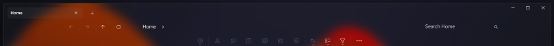

# The Windows 11 file explorer styling guide

## Table of contents

* [Introduction](#introduction)
  * [Finding targets](#finding-targets)
  * [Missing customizations](#missing-customizations)
  * [Contributing](#contributing)
* [Themes](#themes)
* [Explorer frame container height](#explorer-frame-container-height)
* [Tab](#tab)
  * [Tab text color](#tab-text-color)
  * [Tab background](#tab-background)
  * [Remove tab](#remove-tab)
  * [Remove tab close button](#remove-tab-close-button)
  * [Remove tab add button](#remove-tab-add-button)
  * [Remove tab icon](#remove-tab-icon)
* [Navigation Bar](#navigation-bar)
  * [Navigation bar background](#navigation-bar-background)
* [Command Bar](#command-bar)
  * [Command bar background](#command-bar-background)
* [Details view](#details-view)
  * [Details view background](#details-view-background)
  * [Details view thumbnail background](#details-view-thumbnail-background)
* [Home Page](#home-page)
   * [Home page background](#home-page-background)
* [Gallery Page](#gallery-page)
   * [Gallery page background](#gallery-page-background)
* [Desktop context menu](#desktop-context-menu)
   * [Desktop context menu border](#desktop-context-menu-border)
* [Transforms](#transforms)
  * [Translate](#translate)
  * [Rotate](#rotate)
  * [Scale](#scale)
  * [Skew](#skew)
  * [Other properties and attributes](#other-properties-and-attributes)
* [Colors](#colors)
  * [Solid color](#solid-color)
  * [Accent colors](#accent-colors)
  * [Transparent color](#transparent-color)
  * [Acrylic effect as color](#acrylic-effect-as-color)
  * [WindhawkBlur effect as color](#windhawkblur-effect-as-color)
  * [Mica effect as color](#mica-effect-as-color)
  * [Gradient as color](#gradient-as-color)
  * [Image as color](#image-as-color)

## Introduction

This is a collection of commonly requested file explorer styling customizations for
Windows 11. It is intended to be used with the [Windows 11 File Explorer Styler](https://windhawk.net/mods/windows-11-file-explorer-styler) Windhawk mod.

If you're not familiar with Windhawk, here are the steps for installing the mod:

* Download Windhawk from [windhawk.net](https://windhawk.net/) and install it.
* Go to "Mods" in the upper right menu.
* Find and install the "Windows 11 File Explorer Styler" mod.

After installing the mod, open its Settings tab and adjust the styles according
to your preferences.

Some customizations are best adjusted with other Windhawk mods. Links to those
mods are provided where applicable.

**See also**: \
[The Windows 11 start menu styling
guide](https://github.com/ramensoftware/windows-11-start-menu-styling-guide/blob/main/README.md), \
[The Windows 11 taskbar styling
guide](https://github.com/ramensoftware/windows-11-taskbar-styling-guide/blob/main/README.md), \
[The Windows 11 notification center styling
guide](https://github.com/ramensoftware/windows-11-notification-center-styling-guide/blob/main/README.md).

### Finding targets

[How to find targets using UWPSpy](https://github.com/bbmaster123/FWFU/blob/main/uwpspy.md).

### Missing customizations

If you're looking for a customization that is not listed here, please [open an
issue](https://github.com/ramensoftware/windows-11-file-explorer-styling-guide/issues/new).

### Contributing

If you have a file explorer styling customization or theme that you would like to
share, please submit a pull request.

## Themes

Themes are collections of styles that can be imported into the Windows 11
File Explorer Styler mod. The following themes are available:

| Link | Screenshot
| ---- | ----------
| [Translucent Explorer11](Themes/Translucent%20Explorer11/README.md) | [](Themes/Translucent%20Explorer11/screenshot.png)
| [MicaBar](Themes/MicaBar/README.md) | [](Themes/MicaBar/screenshot.png)
| [NoCommandBar](Themes/NoCommandBar/README.md) | [](Themes/NoCommandBar/screenshot.png)
| [Minimal Explorer11](Themes/Minimal%20Explorer11/README.md) | [](Themes/Minimal%20Explorer11/screenshot.png)
| [Tabless](Themes/Tabless/README.md) | [](Themes/Tabless/screenshot.png)
| [Matter](Themes/Matter/README.md) | [](Themes/Matter/screenshot.png)
| [WindowGlass](Themes/WindowGlass/README.md) | [](Themes/WindowGlass/screenshot.png)
| [AddressSearchOnly](Themes/AddressSearchOnly/README.md) | [](Themes/AddressSearchOnly/screenshot.png)

## Explorer frame container height

The height of the explorer frame container, which includes the tabs, the address bar, and the command bar; set it to zero to use the default height.

## Tab

### Tab text color

Target:
```
Grid#TabContainer > ContentPresenter > StackPanel > TextBlock
```
Style:
```
Foreground=Magenta
```

### Tab background

Target:
```
TabViewItem > Grid#LayoutRoot > Canvas > Microsoft.UI.Xaml.Shapes.Path#SelectedBackgroundPath
```
Style:
```
Fill=#00FFFF
```

### Remove tab

Target:
```
TabViewItem > Grid#LayoutRoot
```
Style:
```
Visibility=Collapsed
```

### Remove tab close button

Target:
```
Button#CloseButton
```
Style:
```
Visibility=Collapsed
```

### Remove tab add button

Target:
```
Button#AddButton
```
Style:
```
Visibility=Collapsed
```

### Remove tab icon

Target:
```
Grid#TabContainer > Viewbox#IconBox
```
Style:
```
Visibility=Collapsed
```

## Navigation Bar

### Navigation bar background

Target:
```
Grid#NavigationBarControlGrid
```
Style:
```
Background:=<SolidColorBrush Color="Grey" TintOpacity="0.4"/>
```

## Command Bar

### Command bar background

Targets:
```
Grid#CommandBarControlRootGrid

CommandBar#FileExplorerCommandBar
```
Style:
```
Background=Transparent
```

## Details view

### Details view background

Target:
```
Grid#DetailsViewControlRootGrid
```
Style:
```
Background=#FFFF00
```

### Details view thumbnail background

Target:
```
StackPanel#DetailsViewThumbnail
```
Style:
```
Background=#FFFF00
```

## Home Page

### Home page background

Target:
```
Grid#HomeViewRootGrid
```
Style:
```
Background=#FFFF00
```

## Gallery page

### Gallery page background

Targets:
```
FileExplorerExtensions.GalleryViewControl#GalleryViewControl > Grid

FileExplorerExtensions.GalleryViewControl#GalleryViewControl > Grid > Grid#GalleryRootGrid
```
Style:
```
Background=Transparent
```

## Desktop context menu

### Desktop context menu border

Target:
```
CommandBarOverflowPresenter#SecondaryItemsControl > Grid#LayoutRoot > Border
```
Style:
```
BorderBrush=#00FFFF
```

## Transforms

You can use transformation styles to translate, rotate, scale, or skew elements.

> [!TIP]
> **Should I use `RenderTransform` or `Transform3D`?**
>
> For 2D transformations, it is best to stick to `RenderTransform` in most cases. Using `Transform3D` for 2D transformations can cause elements to become blurry. For 3D transformations, you must use `Transform3D`.

> [!TIP]
> You can mix and match transformations when using `Transform3D`! You can also use `RenderTransform` and `Transform3D` together.
>
> For example: `Transform3D:=<CompositeTransform3D ScaleX="1.5" TranslateY="-15" RotationZ="15" />`

### Translate

```
RenderTransform:=<TranslateTransform X="15" Y="-15" />
```

-- or --

```
Transform3D:=<CompositeTransform3D TranslateX="15" TranslateY="-15" TranslateZ="-15" />
```

### Rotate

```
RenderTransform:=<RotateTransform Angle="15" />
```

-- or --

```
Transform3D:=<CompositeTransform3D RotationX="-15" RotationY="15" RotationZ="-15" />
```

- `X`: 3D vertical rotation.
- `Y`: 3D horizontal rotation.
- `Z`: 2D rotation.

### Scale

```
RenderTransform:=<ScaleTransform ScaleX="1.5" ScaleY="-1.5" />
```

-- or --

```
Transform3D:=<CompositeTransform3D ScaleX="-1.5" ScaleY="1.5" ScaleZ="-1.5" />
```

### Skew

```
RenderTransform:=<SkewTransform AngleX="-15" AngleY="15" />
```

### Other properties and attributes

- Applies to Rotate, Scale and Skew:
  - `CenterX`: Offsets the transform's origin on the X axis.
  - `CenterY`: Offsets the transform's origin on the Y axis.
  - `CenterZ`: Offsets the transform's origin on the Z axis. (Only for `Transform3D`)

  Example:
  ```
  RenderTransform:=<RotateTransform Angle="15" CenterX="10" CenterY="20" />
  ```
- `RenderTransformOrigin`
  - Applies to `RenderTransform` only, `Transform3D` does not support this attribute. It is a separate attribute and is not set inside of the `RenderTransform` like `CenterX/Y/Z`.
  - Sets the transform origin relative to its target's width and height. Format is `X,Y` and both numbers range from 0-1.

  Example:

  ```
  RenderTransformOrigin=0.5,0.5
  ```
  This centers the transform's origin.
- `TransformGroup`
  - Applies to `RenderTransform` only, `Transform3D` does not support this attribute. It is a separate attribute and is not set inside of the `RenderTransform` like `CenterX/Y/Z`.
  - Allows you to combine RenderTransforms together into one style, mimicking Transform3D's functionality.

  Example:
  ```
  RenderTransform:=<TransformGroup><RotateTransform Angle="15" /><TranslateTransform X="15" Y="-15" /></TransformGroup>
  ```

## Colors

In the following examples, we're going to use `Fill` as an example, but this
also works for other properties that accept colors, like `Background`.

### Solid color

```
Fill=<color>
```

Replace `<color>` with the desired color.

A color can be a name (e.g. `Red`) or a hex code (e.g. `#FF0000`).

The color can be semi-transparent (e.g. `#80FF0000`). To have a fully
transparent background, use `Transparent`.

### Accent colors

A color can also be a `ThemeResource` or `StaticResource`. There are many such
styles built into Windows.

```
Fill:=<SolidColorBrush Color="{ThemeResource SystemAccentColor}" Opacity="0.8" />
```

Accent colors have different lightness available, like `SystemAccentColorLight2`
or `SystemAccentColorDark1`. The word `Light` or `Dark` is appended at the end
with a number ranging from 1 to 3. Check out [the official Microsoft
docs](https://learn.microsoft.com/en-us/windows/apps/design/style/color#accent-color-palette)
for all variations.

```
Fill:=<SolidColorBrush Color="{ThemeResource SystemAccentColorDark2}" Opacity="0.5" />
```

### Transparent color

To have a fully transparent background, use the following style:

```
Fill=Transparent
```

### Acrylic effect as color

In order to have an acrylic effect (a blurred background), you can use
`AcrylicBrush`. It comes with `TintOpacity`, which defines how much of the color
needs to be applied.

```
Fill:=<AcrylicBrush TintColor="Black" TintOpacity="0.8" />
```

You can also mix acrylic with a variation of an accent color for a more dynamic
look that fits the current theme.

```
Fill:=<AcrylicBrush TintColor="{ThemeResource SystemAccentColorDark2}" TintOpacity="0.3" />
```

### WindhawkBlur effect as color

An alternative to Acrylic is the mod's own blur implementation called `WindhawkBlur`. It differs from Acrylic because it has a customizable blur radius and has fewer bugs (e.g. https://github.com/ramensoftware/windhawk-mods/issues/742).

```
Fill:=<WindhawkBlur BlurAmount="10" TintColor="#80ff0000" />
```
_This example sets a blur that is tinted with red at 50% opacity._

- `BlurAmount`: Radius of blur effect (set to 30 to mimic Acrylic).
- `TintColor`: Hex color in `#AARRGGBB` format that is applied to the blur.
  - `ThemeResource` colors and color names (e.g. `Red`) are currently not supported.

### Mica effect as color

> [!NOTE]
> Unfortunately, it is not possible to set a Mica effect at this time with any of Windhawk's styler mods.

### Gradient as color

The background can also be a gradient. For example, to have a gradient from
yellow to red to blue to lime green, use the following style:

```
Fill:=<LinearGradientBrush StartPoint="0,0.5" EndPoint="1,0.5"><GradientStop Color="Yellow" Offset="0.0" /><GradientStop Color="Red" Offset="0.25" /><GradientStop Color="Blue" Offset="0.75" /><GradientStop Color="LimeGreen" Offset="1.0" /></LinearGradientBrush>
```

### Image as color

The background can also be an image:

```
Fill:=<ImageBrush Stretch="UniformToFill" ImageSource="<image>" />
```

Replace `<image>` with your own image, a URL or a local file path.
