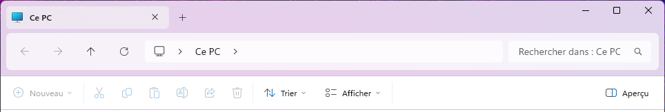
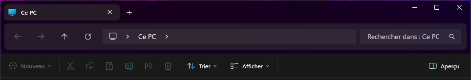

# Float for Windows 11 File Explorer Styler
A theme that gives Windows 11 File Explorer a floating adress bar along with floating tabs

**Author**: [Lerakei-0](https://github.com/Lerakei-0)

## Preview



## Theme selection

The theme is integrated into the mod and can be selected directly from the mod's
settings:

* Open the Windows 11 File Explorer Styler mod in Windhawk.
* Go to the "Settings" tab.
* Select the theme and save the settings.

## Manual installation

The theme styles can also be imported manually. To do that, follow these steps:

* Open the Windows 11 File Explorer Styler mod in Windhawk.
* Go to the "Settings" tab and select "Textual mode".
* Copy the content below to the text box and click "Save settings".

<details>
<summary>Content to import (click to expand)</summary>

```yaml
theme: 'Float'
backgroundTranslucentEffect: ''
backgroundTranslucentEffectRegion: ''
styleConstants:
  - ''
controlStyles:
  - target: TabViewItem > Grid#LayoutRoot@CommonStates
    styles:
      - Background@Selected:=<AcrylicBrush TintColor="{ThemeResource Tab}" TintOpacity="0.9" Opacity="0.6"/>
      - Background@PointerOverSelected:=<AcrylicBrush TintColor="{ThemeResource Tab}" TintOpacity="0.9" Opacity="0.7"/>
      - Background@PointerOver:=<AcrylicBrush TintColor="{ThemeResource Tab}" TintOpacity="0.9" Opacity="0.3"/>
      - Background@Normal:=<AcrylicBrush TintColor="{ThemeResource Tab}" TintOpacity="0.9" Opacity="0"/>
      - Background@PressedSelected:=<AcrylicBrush TintColor="{ThemeResource Tab}" TintOpacity="0.9" Opacity="0.9"/>
      - CornerRadius=6
  - target: TabViewItem > Grid#LayoutRoot > Grid#TabContainer
    styles:
      - Background=Transparent
      - BorderThickness=0
  - target: TabViewItem > Grid#LayoutRoot > Canvas
    styles:
      - Visibility=Collapsed
  - target: TabViewItem > Grid#LayoutRoot
    styles:
      - BorderThickness=1
      - Margin=2,0,0,0
      - Height=35
  - target: Microsoft.UI.Xaml.Controls.Border#BottomBorderLine
    styles:
      - Visibility=Collapsed
  - target: Grid#TabContainerGrid > Border#LeftBottomBorderLine
    styles:
      - Visibility=Collapsed
  - target: Grid#TabContainerGrid > Border#RightBottomBorderLine
    styles:
      - Visibility=Collapsed
  - target: TabViewItem
    styles:
      - CornerRadius=4
  - target: Grid#TabContainerGrid > Border > Button#AddButton
    styles:
      - Visibility=Visible
      - Margin=0,0,0,3
      - CornerRadius=10
      - BorderThickness=0
      - Width=24
      - Height=24
  - target: Microsoft.UI.Xaml.Controls.Grid#TabContainerGrid
    styles:
      - Height=44
  - target: Microsoft.UI.Xaml.Controls.Border#RightBottomBorderLine
    styles:
      - Visibility=Collapsed
  - target: Microsoft.UI.Xaml.Controls.Border#LeftBottomBorderLine
    styles:
      - Visibility=Collapsed
  - target: Microsoft.UI.Xaml.Controls.Grid#NavigationBarControlGrid
    styles:
      - CornerRadius=6
      - Margin=8,4,8,0
      - Height=54
  - target: Microsoft.UI.Xaml.Controls.Grid#CommandBarControlRootGrid
    styles:
      - Margin=0,8,0,0
      - BorderThickness=0,1,0,1
  - target: Microsoft.UI.Xaml.Controls.Primitives.TabViewListView#TabListView
    styles:
      - Margin=-3,0,0,0
  - target: Microsoft.UI.Xaml.Shapes.Path#RightRadiusRenderArc
    styles:
      - Visibility=Collapsed
  - target: Microsoft.UI.Xaml.Shapes.Path#LeftRadiusRenderArc
    styles:
      - Visibility=Collapsed
themeResourceVariables:
  - Tab@Light=#ffffffff
  - Tab@Dark=#000000
explorerFrameContainerHeight: 160
xamlDiagnosticsHandling: ''

```
</details>
