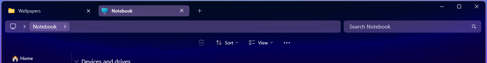
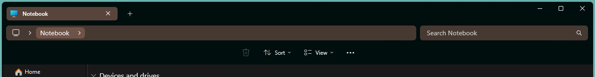
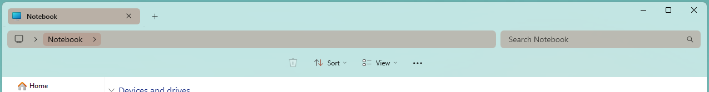

# Matter theme for Windows 11 File Explorer Styler

A theme that modifies the WinUI elements of Windows 11 File Explorer.

**Author**: [ZoraizLajwer](https://github.com/ZoraizLajwer)



**To get translucent effects, you can use the Translucent Windows mod.**

- Install the [Translucent Windows](https://windhawk.net/mods/translucent-windows) mod.
- Select an effect type option and save.

## Without the Translucent Windows mod
### Dark mode


### Light mode


## Theme selection

The theme is integrated into the mod and can simply be selected from the mod's
settings:

* Open the Windows 11 File Explorer Styler mod in Windhawk.
* Go to the "Settings" tab.
* Select the theme and save the settings.

## Manual installation

The theme styles can also be imported manually. To do that, follow these steps:

* Open the Windows 11 File Explorer Styler mod in Windhawk.
* Go to the "Advanced" tab.
* Copy the content below to the text box under "Mod settings" and click "Save".

<details>
<summary>Content to import (click to expand)</summary>

```json
{
  "explorerFrameContainerHeight": 0,
  "controlStyles[0].target": "CommandBar#FileExplorerCommandBar ",
  "controlStyles[0].styles[0]": "Background=Transparent",
  "controlStyles[1].target": "CommandBar#FileExplorerSecondaryCommandBar",
  "controlStyles[1].styles[0]": "Background=Transparent",
  "theme": "",
  "controlStyles[2].target": "Grid#TabContainerGrid > Border#LeftBottomBorderLine",
  "controlStyles[2].styles[0]": "Visibility=Collapsed",
  "controlStyles[3].styles[0]": "Visibility=Collapsed",
  "controlStyles[3].target": "Grid#TabContainerGrid > Border#RightBottomBorderLine",
  "controlStyles[4].target": "TabViewItem",
  "controlStyles[4].styles[0]": "Margin=0,0,4,0",
  "controlStyles[5].target": "TabViewItem > Grid#LayoutRoot",
  "controlStyles[5].styles[0]": "CornerRadius=5",
  "controlStyles[5].styles[1]": "Margin=2,4,0,4",
  "controlStyles[5].styles[2]": "Height=29",
  "controlStyles[6].target": "TabViewItem > Grid#LayoutRoot > Canvas",
  "controlStyles[6].styles[0]": "Visibility=Collapsed",
  "controlStyles[7].target": "TabViewItem > Grid#LayoutRoot > Grid#TabContainer",
  "controlStyles[7].styles[0]": "Background = Transparent ",
  "controlStyles[8].target": "TabViewItem > Grid#LayoutRoot@CommonStates",
  "controlStyles[8].styles[0]": "Background@Selected:= $accentColor2",
  "controlStyles[8].styles[1]": "Background@PointerOverSelected:= $accentColor",
  "controlStyles[8].styles[2]": "Background@PointerOver:= $accentColor2",
  "controlStyles[8].styles[3]": "Background@Normal=$accentColor",
  "controlStyles[8].styles[4]": "Background@PressedSelected:=$accentColor2",
  "controlStyles[9].target": "Grid#TabContainerGrid > Border > Button#AddButton",
  "controlStyles[10].target": "Grid#CommandBarControlRootGrid",
  "controlStyles[10].styles[0]": "Background=Transparent ",
  "controlStyles[11].target": "Grid#NavigationBarControlGrid",
  "controlStyles[11].styles[0]": "Background=Transparent ",
  "controlStyles[12].target": "Grid#PART_LayoutRoot",
  "controlStyles[12].styles[0]": "Background :=<SolidColorBrush Color=\"{ThemeResource SystemAccentColorLight1}\" Opacity=\"0.4\" />",
  "styleConstants[0]": "accentColor=<SolidColorBrush Color=\"{ThemeResource SystemAccentColorLight1}\" />",
  "controlStyles[13].target": "FileExplorerExtensions.CommandBarControl",
  "controlStyles[14].target": "AutoSuggestBox#FileExplorerSearchBox > Grid#LayoutRoot > TextBox > Grid@CommonStates > Border#BorderElement",
  "controlStyles[14].styles[0]": "Background :=<SolidColorBrush Color=\"{ThemeResource SystemAccentColorLight1}\" Opacity=\"0.4\" />",
  "controlStyles[14].styles[1]": "CornerRadius = 6",
  "controlStyles[12].styles[1]": "CornerRadius = 6",
  "controlStyles[10].styles[1]": "BorderThickness = 0",
  "styleConstants[1]": "accentColor2=<SolidColorBrush Color=\"{ThemeResource SystemAccentColorLight1}\" Opacity=\"0.5\" />",
  "controlStyles[14].styles[2]": "BorderThickness = 0",
  "controlStyles[12].styles[2]": "BorderThickness = 0",
  "controlStyles[13].styles[0]": "Margin = 0,-5,0,0",
  "controlStyles[15].target": "Microsoft.UI.Xaml.Controls.AppBarButton[ToolTipService.ToolTip = Cut]",
  "controlStyles[15].styles[0]": "Visibility  = 1",
  "controlStyles[16].target": "Microsoft.UI.Xaml.Controls.AppBarButton[ToolTipService.ToolTip = Copy]",
  "controlStyles[16].styles[0]": "Visibility  = 1",
  "controlStyles[17].target": "Microsoft.UI.Xaml.Controls.AppBarButton[ToolTipService.ToolTip = Paste]",
  "controlStyles[17].styles[0]": "Visibility  = 1",
  "controlStyles[18].target": "Microsoft.UI.Xaml.Controls.AppBarButton[ToolTipService.ToolTip = Rename]",
  "controlStyles[18].styles[0]": "Visibility  = 1",
  "controlStyles[19].target": "Microsoft.UI.Xaml.Controls.AppBarButton[ToolTipService.ToolTip = Share]",
  "controlStyles[19].styles[0]": "Visibility  = 1",
  "controlStyles[20].target": "Microsoft.UI.Xaml.Controls.AppBarSeparator",
  "controlStyles[20].styles[0]": "Visibility  = 1",
  "controlStyles[21].target": "Microsoft.UI.Xaml.Controls.Border#ScrollDecreaseButtonContainer",
  "controlStyles[21].styles[0]": "Margin = 0,0,0,3",
  "controlStyles[22].target": "Microsoft.UI.Xaml.Controls.Border#ScrollIncreaseButtonContainer",
  "controlStyles[22].styles[0]": "Margin = 0,0,0,3",
  "resourceVariables[0].variableKey": "",
  "resourceVariables[0].value": "",
  "controlStyles[23].target": "Microsoft.UI.Xaml.Controls.AppBarButton#refreshButton",
  "controlStyles[23].styles[0]": "Visibility  =1",
  "controlStyles[24].target": "Microsoft.UI.Xaml.Controls.AppBarButton#upButton",
  "controlStyles[24].styles[0]": "Visibility  =1",
  "controlStyles[25].styles[0]": "Visibility  =1",
  "controlStyles[26].styles[0]": "Visibility  =1",
  "controlStyles[25].target": "Microsoft.UI.Xaml.Controls.AppBarButton#forwardButton",
  "controlStyles[26].target": "Microsoft.UI.Xaml.Controls.AppBarButton#backButton",
  "controlStyles[9].styles[0]": "Visibility  = 0",
  "controlStyles[7].styles[1]": "BorderThickness = 0",
  "controlStyles[8].styles[5]": "Background@Pressed := $accentColor2",
  "controlStyles[27].target": "Microsoft.UI.Xaml.Controls.AppBarButton[ToolTipService.ToolTip = Create a new item in the current location.]",
  "controlStyles[27].styles[0]": "Visibility  = 1",
  "controlStyles[9].styles[1]": "Margin = 0,0,0,3",
  "controlStyles[1].styles[1]": "Visibility = 1",
  "controlStyles[0].styles[1]": "HorizontalAlignment  = 1"
}
```
</details>
