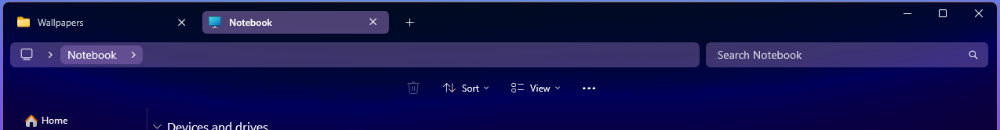
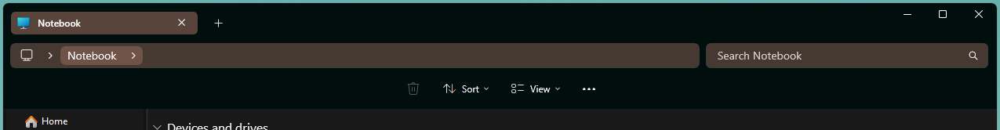
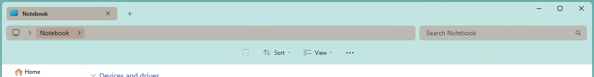

# Matter theme for Windows 11 File Explorer Styler

A theme that modifies the WinUI elements of Windows 11 File Explorer.

**Author**: [ZoraizLajwer](https://github.com/ZoraizLajwer)



**To get translucent effects, you can use the Translucent Windows mod.**

- Install the [Translucent Windows](https://windhawk.net/mods/translucent-windows) mod.
- Select an effect type option and save.

## Without the Translucent Windows mod
### Dark mode


### Light mode


## Theme selection

The theme is integrated into the mod and can be selected directly from the mod's
settings:

* Open the Windows 11 File Explorer Styler mod in Windhawk.
* Go to the "Settings" tab.
* Select the theme and save the settings.

## Manual installation

The theme styles can also be imported manually. To do that, follow these steps:

* Open the Windows 11 File Explorer Styler mod in Windhawk.
* Go to the "Settings" tab and select "Textual mode".
* Copy the content below to the text box and click "Save settings".

<details>
<summary>Content to import (click to expand)</summary>

```yaml
styleConstants:
  - accentColor=<SolidColorBrush Color="{ThemeResource SystemAccentColorLight1}" />
  - accentColor2=<SolidColorBrush Color="{ThemeResource SystemAccentColorLight1}" Opacity="0.5" />
controlStyles:
  - target: CommandBar#FileExplorerCommandBar
    styles:
      - Background=Transparent
      - HorizontalAlignment  = 1
  - target: CommandBar#FileExplorerSecondaryCommandBar
    styles:
      - Background=Transparent
      - Visibility = 1
  - target: Grid#TabContainerGrid > Border#LeftBottomBorderLine
    styles:
      - Visibility=Collapsed
  - target: Grid#TabContainerGrid > Border#RightBottomBorderLine
    styles:
      - Visibility=Collapsed
  - target: TabViewItem
    styles:
      - Margin=0,0,4,0
  - target: TabViewItem > Grid#LayoutRoot
    styles:
      - CornerRadius=5
      - Margin=2,4,0,4
      - Height=29
  - target: TabViewItem > Grid#LayoutRoot > Canvas
    styles:
      - Visibility=Collapsed
  - target: TabViewItem > Grid#LayoutRoot > Grid#TabContainer
    styles:
      - Background = Transparent
      - BorderThickness = 0
  - target: TabViewItem > Grid#LayoutRoot@CommonStates
    styles:
      - Background@Selected:= $accentColor2
      - Background@PointerOverSelected:= $accentColor
      - Background@PointerOver:= $accentColor2
      - Background@Normal=$accentColor
      - Background@PressedSelected:=$accentColor2
      - Background@Pressed := $accentColor2
  - target: Grid#TabContainerGrid > Border > Button#AddButton
    styles:
      - Visibility  = 0
      - Margin = 0,0,0,3
  - target: Grid#CommandBarControlRootGrid
    styles:
      - Background=Transparent
      - BorderThickness = 0
  - target: Grid#NavigationBarControlGrid
    styles:
      - Background=Transparent
  - target: Grid#PART_LayoutRoot
    styles:
      - Background :=<SolidColorBrush Color="{ThemeResource SystemAccentColorLight1}" Opacity="0.4" />
      - CornerRadius = 6
      - BorderThickness = 0
  - target: FileExplorerExtensions.CommandBarControl
    styles:
      - Margin = 0,-5,0,0
  - target: AutoSuggestBox#FileExplorerSearchBox > Grid#LayoutRoot > TextBox > Grid@CommonStates > Border#BorderElement
    styles:
      - Background :=<SolidColorBrush Color="{ThemeResource SystemAccentColorLight1}" Opacity="0.4" />
      - CornerRadius = 6
      - BorderThickness = 0
  - target: Microsoft.UI.Xaml.Controls.AppBarButton[ToolTipService.ToolTip = Cut]
    styles:
      - Visibility  = 1
  - target: Microsoft.UI.Xaml.Controls.AppBarButton[ToolTipService.ToolTip = Copy]
    styles:
      - Visibility  = 1
  - target: Microsoft.UI.Xaml.Controls.AppBarButton[ToolTipService.ToolTip = Paste]
    styles:
      - Visibility  = 1
  - target: Microsoft.UI.Xaml.Controls.AppBarButton[ToolTipService.ToolTip = Rename]
    styles:
      - Visibility  = 1
  - target: Microsoft.UI.Xaml.Controls.AppBarButton[ToolTipService.ToolTip = Share]
    styles:
      - Visibility  = 1
  - target: Microsoft.UI.Xaml.Controls.AppBarSeparator
    styles:
      - Visibility  = 1
  - target: Microsoft.UI.Xaml.Controls.Border#ScrollDecreaseButtonContainer
    styles:
      - Margin = 0,0,0,3
  - target: Microsoft.UI.Xaml.Controls.Border#ScrollIncreaseButtonContainer
    styles:
      - Margin = 0,0,0,3
  - target: Microsoft.UI.Xaml.Controls.AppBarButton#refreshButton
    styles:
      - Visibility  =1
  - target: Microsoft.UI.Xaml.Controls.AppBarButton#upButton
    styles:
      - Visibility  =1
  - target: Microsoft.UI.Xaml.Controls.AppBarButton#forwardButton
    styles:
      - Visibility  =1
  - target: Microsoft.UI.Xaml.Controls.AppBarButton#backButton
    styles:
      - Visibility  =1
  - target: Microsoft.UI.Xaml.Controls.AppBarButton[ToolTipService.ToolTip = Create a new item in the current location.]
    styles:
      - Visibility  = 1
```
</details>
