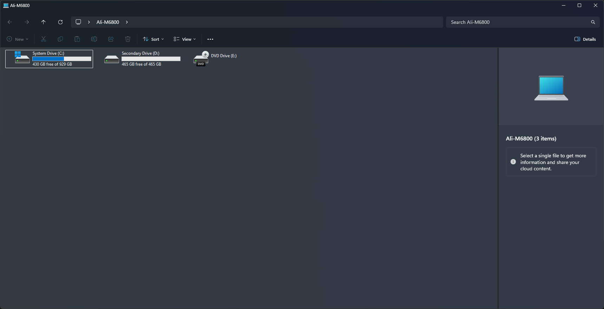

# MicaTabless theme for Windows 11 File Explorer Styler

Theme that adds your backdrop of choice to top toolbars and preview/details pane, and (visually) removes the tab switcher.
Bonus: if you have MicaForEveryone or Translucent Backdrops Windhawk mod, the File Explorer UI and the preview/details pane will also have a matching backdrop.
Screenshot is full-size to also show the preview/details pane.

**Author**: [Ali Cool](https://github.com/AliCool412)


<!--
## Theme selection

The theme is integrated into the mod and can be selected directly from the mod's
settings:

* Open the Windows 11 File Explorer Styler mod in Windhawk.
* Go to the "Settings" tab.
* Select the theme and save the settings.

## Manual installation

The theme styles can also be imported manually. To do that, follow these steps:
-->
## Manual installation

The theme styles can be imported manually. To do that, follow these steps:

* Open the Windows 11 File Explorer Styler mod in Windhawk.
* Go to the "Settings" tab and select "Textual mode".
* Copy the content below to the text box and click "Save settings".

<details>
<summary>Content to import (click to expand)</summary>

```yaml
styleConstants:
  - NavigationBarGrid=1
  - CommandBarGrid=2
controlStyles:
  - target: Microsoft.UI.Xaml.Controls.Grid#CommandBarControlRootGrid
    styles:
      - Background=Transparent
  - target: Microsoft.UI.Xaml.Controls.Grid#ContentRoot
    styles:
      - Background=Transparent
  - target: FileExplorerExtensions.NavigationBarControl
    styles:
      - Grid.Row=$NavigationBarGrid
  - target: FileExplorerExtensions.CommandBarControl
    styles:
      - Grid.Row=$CommandBarGrid
  - target: Microsoft.UI.Xaml.Controls.Grid#TabContainerGrid > Border
    styles:
      - Visibility=Collapsed
  - target: Microsoft.UI.Xaml.Controls.Grid#TabContainer > Microsoft.UI.Xaml.Controls.Button#CloseButton
    styles:
      - Visibility=Collapsed
  - target: Microsoft.UI.Xaml.Controls.TabViewItem > Microsoft.UI.Xaml.Controls.Grid#LayoutRoot > Microsoft.UI.Xaml.Controls.Canvas
    styles:
      - Opacity=0
  - target: Grid#NavigationBarControlGrid
    styles:
      - Background:=<SolidColorBrush Color="{ThemeResource SystemChromeLowColor}" />
  - target: Microsoft.UI.Xaml.Controls.Grid#TabContainer
    styles:
      - BorderThickness=0
  - target: Microsoft.UI.Xaml.Controls.ContentPresenter > Microsoft.UI.Xaml.Controls.StackPanel > Microsoft.UI.Xaml.Controls.TextBlock
    styles:
      - FontFamily=Segoe UI, Segoe Fluent Icons
      - FontWeight=Normal
  - target: Microsoft.UI.Xaml.Controls.Grid#CommandBarControlRootGrid
    styles:
      - BorderThickness=0,0,0,1
  - target: FileExplorerExtensions.FileExplorerTabControl
    styles:
      - Height=36
  - target: Microsoft.UI.Xaml.Controls.Grid#TabContainer
    styles:
      - Padding=1,0,0,1
  - target: Microsoft.UI.Xaml.Controls.Viewbox#IconBox
    styles:
      - Margin=0,0,4,0
  - target: Microsoft.UI.Xaml.Controls.TabViewItem
    styles:
      - Margin=0,-8,0,0
  - target: Microsoft.UI.Xaml.Controls.Grid#NavigationBarControlGrid
    styles:
      - Background=Transparent
  - target: Microsoft.UI.Xaml.Controls.Grid#DetailsViewControlRootGrid
    styles:
      - Background=Transparent
  - target: Microsoft.UI.Xaml.Controls.AppBarSeparator
    styles:
      - //Opacity=0
```
</details>
