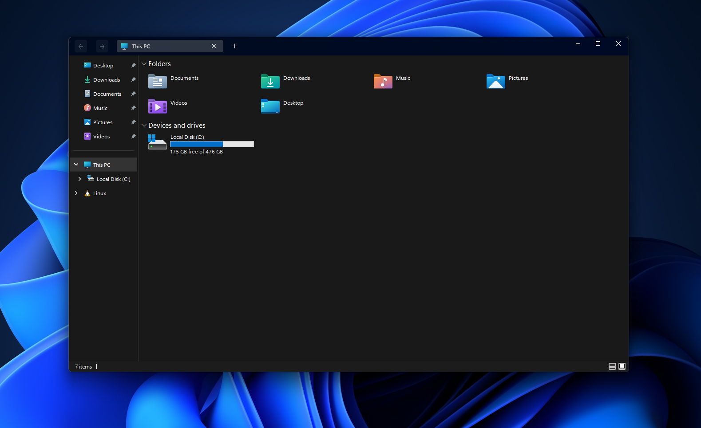

# Minimal Explorer11 theme for Windows 11 File Explorer Styler

A minimalistic theme for the Windows 11 File Explorer Styler mod.

**Author**: [Undisputed00x](https://github.com/Undisputed00x)



## Theme selection

The theme is integrated into the mod and can be selected directly from the mod's
settings:

* Open the Windows 11 File Explorer Styler mod in Windhawk.
* Go to the "Settings" tab.
* Select the theme and save the settings.

## Manual installation

The theme styles can also be imported manually. To do that, follow these steps:

* Open the Windows 11 File Explorer Styler mod in Windhawk.
* Go to the "Settings" tab and select "Textual mode".
* Copy the content below to the text box and click "Save settings".

<details>
<summary>Content to import (click to expand)</summary>

```yaml
controlStyles:
  - target: AppBarButton#backButton > Grid#Root@CommonStates > Border#AppBarButtonInnerBorder
    styles:
      - Background@Normal:=<AcrylicBrush TintColor="Transparent" Opacity="0.07"/>
      - Background@PointerOver:=<AcrylicBrush TintColor="Transparent" Opacity="0.12"/>
      - Background@Pressed:=<AcrylicBrush TintColor="Transparent" Opacity="0.12"/>
      - Background@Disabled:=<AcrylicBrush TintColor="Transparent" Opacity="0.05"/>
  - target: AppBarButton#forwardButton > Grid#Root@CommonStates > Border#AppBarButtonInnerBorder
    styles:
      - Background@Normal:=<AcrylicBrush TintColor="Transparent" Opacity="0.05"/>
      - Background@PointerOver:=<AcrylicBrush TintColor="Transparent" Opacity="0.12"/>
      - Background@Pressed:=<AcrylicBrush TintColor="Transparent" Opacity="0.12"/>
      - Background@Disabled:=<AcrylicBrush TintColor="Transparent" Opacity="0.05"/>
  - target: AppBarButton#refreshButton
    styles:
      - Visibility=Collapsed
  - target: AppBarButton#upButton
    styles:
      - Visibility=Collapsed
  - target: Border#BottomBorderLine
    styles:
      - Visibility=Collapsed
  - target: FileExplorerExtensions.CommandBarControl
    styles:
      - Visibility=Collapsed
  - target: FileExplorerExtensions.AddressBarControl > Grid#PART_LayoutRoot > Grid#NormalModeGrid
    styles:
      - BorderThickness=0,0,0,1
      - BorderBrush=#A0A0A0
  - target: Grid#DetailsViewControlRootGrid
    styles:
      - Background=Transparent
  - target: Grid#TabContainerGrid > Border#LeftBottomBorderLine
    styles:
      - Visibility=Collapsed
  - target: Grid#TabContainerGrid > Border#RightBottomBorderLine
    styles:
      - Visibility=Collapsed
  - target: StackPanel#DetailsViewThumbnail > Grid
    styles:
      - Background=Transparent
  - target: TabViewItem
    styles:
      - Margin=0,0,3,0
  - target: TabViewItem > Grid#LayoutRoot
    styles:
      - CornerRadius=4
      - Margin=0,-3,0,3
      - Height=28
  - target: TabViewItem > Grid#LayoutRoot > Canvas
    styles:
      - Visibility=Collapsed
  - target: TabViewItem > Grid#LayoutRoot > Grid#TabContainer
    styles:
      - Background=Transparent
      - BorderBrush=Transparent
  - target: TabViewItem > Grid#LayoutRoot@CommonStates
    styles:
      - Background@Selected:=<SolidColorBrush Color="#808080" Opacity="0.35"/>
      - Background@PointerOverSelected:=<SolidColorBrush Color="#808080" Opacity="0.35"/>
      - Background@PointerOver:=<AcrylicBrush TintColor="Transparent" Opacity="0.13"/>
      - Background@Normal:=<AcrylicBrush TintColor="Transparent" Opacity="0.05"/>
      - Background@PressedSelected:=<SolidColorBrush Color="#808080" Opacity="0.35"/>
  - target: Grid#FileExplorerAddressBarGrid
    styles:
      - Grid.ColumnSpan=2
      - Margin=0,0,10,0
  - target: AutoSuggestBox#FileExplorerSearchBox
    styles:
      - Visibility=Collapsed
  - target: AppBarButton#backButton > Grid#Root
    styles:
      - Padding=2
  - target: AppBarButton#forwardButton > Grid#Root
    styles:
      - Padding=2
  - target: AppBarButton#forwardButton > Grid#Root > Grid#ContentRoot > Viewbox#ContentViewbox
    styles:
      - Margin=9
  - target: AppBarButton#backButton > Grid#Root > Grid#ContentRoot > Viewbox#ContentViewbox
    styles:
      - Margin=9
  - target: Grid#PART_LayoutRoot
    styles:
      - MinHeight=28
      - Height=28
  - target: Grid#TabContainerGrid > Border > Button#AddButton
    styles:
      - Margin=0,0,20,4
  - target: Border#ScrollIncreaseButtonContainer
    styles:
      - Margin=0,0,0,4
  - target: Border#ScrollDecreaseButtonContainer
    styles:
      - Margin=0,0,0,4
  - target: Grid#FileExplorerAddressBarGrid
    styles:
      - Visibility=Collapsed
  - target: FileExplorerExtensions.NavigationBarControl#NavigationBarControl
    styles:
      - Grid.Row=0
      - Grid.RowSpan=2
  - target: FileExplorerExtensions.FileExplorerTabControl
    styles:
      - Margin=100,0,0,-15
      - Grid.RowSpan=2
  - target: FileExplorerExtensions.NavigationBarControl > Grid#NavigationBarControlGrid
    styles:
      - Margin=0,0,0,-18
      - Background=Transparent
      - Width=100
      - HorizontalAlignment=0
explorerFrameContainerHeight: 42
```
</details>
