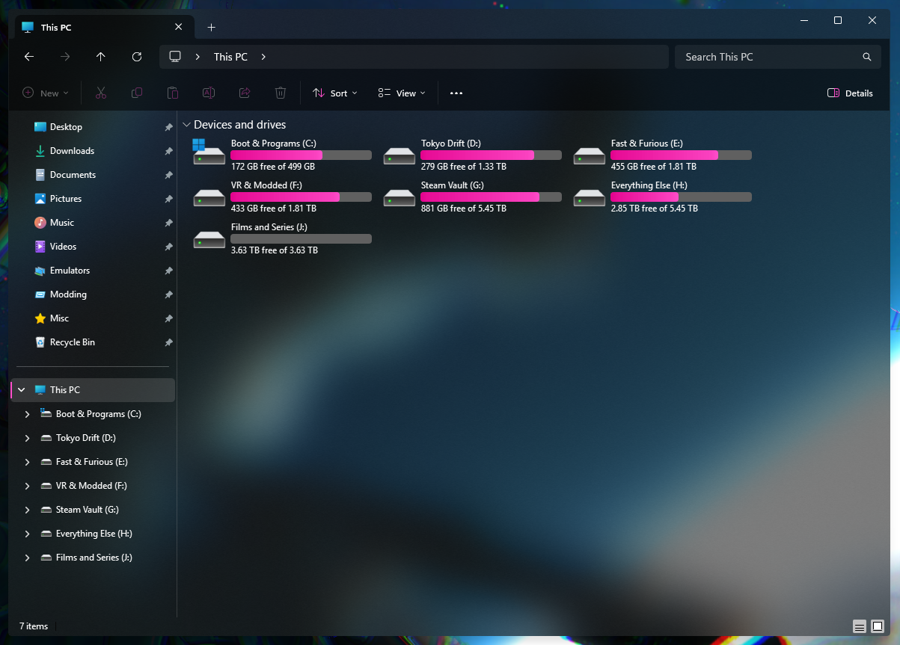

# TintedGlass theme for Windows 11 File Explorer Styler

**Author**: [TheRealCisWhiteMale](https://github.com/TheRealCisWhiteMale)



## Notes
* This taskbar theme is designed to be used in dark mode.

## Required Windhawk mods for similar results
To achieve similar results, install and configure the following Windhawk mods in addition to Windows 11 File Explorer Styler:

- Translucent Windows

<details>
<summary>Click to expand mod settings</summary>

```yaml
RenderingMod:
  ThemeBackground: 1
  SysColors: 1
  AccentColorControls: 1
  TextAlphaBlend: 1
type: acrylicblur
AccentBlurBehind: '80000000'
FlyoutsEffects: 1
ImmersiveDarkTitle: 1
ExtendFrame: 1
CornerOption: smallround
RainbowSpeed: 1
TitlebarColor:
  ColorTitlebar: 0
  RainbowTitlebar: 0
  titlerbarstyles_active: '0'
  titlerbarstyles_inactive: '0'
TitlebarTextColor:
  ColorTitlebarText: 0
  RainbowTextColor: 0
  titlerbarcolorstyles_active: FFFFFF
  titlerbarcolorstyles_inactive: FFFFFF
BorderColor:
  ColorBorder: 1
  RainbowBorder: 0
  borderstyles_active: '0'
  borderstyles_inactive: '0'
  MenuBorderColor: 1
RuledPrograms:
  - target: notepad.exe
    RenderingMod:
      ThemeBackground: 0
      AccentColorControls: 0
    type: acrylicsystem
    AccentBlurBehind: '80000000'
    ImmersiveDarkTitle: 1
    ExtendFrame: 0
    CornerOption: smallround
    RainbowSpeed: 1
    TitlebarColor:
      ColorTitlebar: 0
      RainbowTitlebar: 0
      titlerbarstyles_active: FF0000
      titlerbarstyles_inactive: 00FFFF
    TitlebarTextColor:
      ColorTitlebarText: 0
      RainbowTextColor: 0
      titlerbarcolorstyles_active: FFFFFF
      titlerbarcolorstyles_inactive: FFFFFF
    BorderColor:
      ColorBorder: 1
      RainbowBorder: 0
      borderstyles_active: '0'
      borderstyles_inactive: '0'
  - target: notepad++.exe
    RenderingMod:
      ThemeBackground: 0
      AccentColorControls: 0
    type: acrylicsystem
    AccentBlurBehind: '80000000'
    ImmersiveDarkTitle: 1
    ExtendFrame: 0
    CornerOption: smallround
    RainbowSpeed: 1
    TitlebarColor:
      ColorTitlebar: 0
      RainbowTitlebar: 0
      titlerbarstyles_active: FF0000
      titlerbarstyles_inactive: 00FFFF
    TitlebarTextColor:
      ColorTitlebarText: 0
      RainbowTextColor: 0
      titlerbarcolorstyles_active: FFFFFF
      titlerbarcolorstyles_inactive: FFFFFF
    BorderColor:
      ColorBorder: 1
      RainbowBorder: 0
      borderstyles_active: '0'
      borderstyles_inactive: '0'
```
</details>

---

## Suggested Windhawk Mods for full theme continuity
To achieve the full look, install and configure the following Windhawk mods in addition to Taskbar Styler:

- Windows 11 Taskbar Styler

[TintedGlass theme for Windows 11 Taskbar Styler](https://github.com/ramensoftware/windows-11-taskbar-styling-guide/blob/main/Themes/TintedGlass/README.md).

---

- Taskbar Clock Customization – for styling the clock. You will need to add your weather location if you have the desire to use that function and may need to change date formatting if you wish.

<details>
<summary>Click to expand mod settings</summary>

```yaml
ShowSeconds: 1
TimeFormat: HH':'mm':'ss
DateFormat: ddd',' dd MMM yyyy
WeekdayFormat: custom
WeekdayFormatCustom: Mon, Tue, Wed, Thu, Fri, Sat, Sun
TopLine: '%time%'
BottomLine: '%date%'
MiddleLine: '%weekday%'
TooltipLine: '%weather%'
TooltipLineMode: append
Width: 180
Height: 60
MaxWidth: 0
TextSpacing: -4
DataCollection:
  NetworkMetricsFormat: mbs
  NetworkMetricsFixedDecimals: -1
  PercentageFormat: spacePaddingAndSymbol
  UpdateInterval: 1
  NetworkAdapterName: ''
  GpuAdapterName: ''
MediaPlayer:
  IgnoredPlayers:
    - ''
  MaxLength: 28
  NoMediaText: No media
  RemoveBrackets: 0
WebContentWeatherLocation: ''
WebContentWeatherFormat: '%c 🌡️%t 🌬️%w'
WebContentWeatherUnits: autoDetect
WebContentsItems:
  - Url: https://rss.nytimes.com/services/xml/rss/nyt/World.xml
    BlockStart: <item>
    Start: <title>
    End: </title>
    ContentMode: xmlHtml
    SearchReplace:
      - Search: ''
        Replace: ''
    MaxLength: 28
WebContentsUpdateInterval: 10
TimeZones:
  - GMT Standard Time
TimeStyle:
  Hidden: 0
  TextColor: ''
  TextAlignment: Right
  FontSize: 16
  FontFamily: ''
  FontWeight: Medium
  FontStyle: ''
  FontStretch: ''
  CharacterSpacing: 70
DateStyle:
  Hidden: 0
  TextColor: ''
  TextAlignment: Right
  FontSize: 12
  FontFamily: ''
  FontWeight: ''
  FontStyle: ''
  FontStretch: ''
  CharacterSpacing: 0
oldTaskbarOnWin11: 0
DataCollectionUpdateInterval: 1
```
</details>

---

- Taskbar Height and Icon Size

<details>
<summary>Click to expand mod settings</summary>

```yaml
TaskbarHeight: 40
IconSize: 32
TaskbarButtonWidth: 40
IconSizeSmall: 16
TaskbarButtonWidthSmall: 32
```
</details>

---

- Taskbar Labels for Windows 11

<details>
<summary>Click to expand mod settings</summary>

```yaml
mode: labelsWithoutCombining
taskbarItemWidth: 0
runningIndicatorStyle: centerFixed
progressIndicatorStyle: sameAsRunningIndicatorStyle
excludedPrograms:
  - excluded1.exe
minimumTaskbarItemWidth: 43
maximumTaskbarItemWidth: 300
fontSize: 13
fontFamily: ''
textTrimming: clip
leftAndRightPaddingSize: 6
spaceBetweenIconAndLabel: 6
runningIndicatorHeight: 0
runningIndicatorVerticalOffset: 0
alwaysShowThumbnailLabels: 0
labelForSingleItem: '%name%'
labelForMultipleItems: '[%amount%] %name%'
```
</details>

---

- Windows 11 Notification Center Styler

[TintedGlass theme for Windows 11 Notification Center Styler](https://github.com/ramensoftware/windows-11-notification-center-styling-guide/blob/main/Themes/TintedGlass/README.md).

---

- Windows 11 Start Menu Styler

[TintedGlass theme for Windows 11 Start Menu Styler](https://github.com/ramensoftware/windows-11-start-menu-styling-guide/blob/main/Themes/TintedGlass/README.md).

---

- Taskbar Background Helper

<details>
<summary>Click to expand mod settings</summary>

```yaml
backgroundStyle: blur
color:
  red: 255
  green: 127
  blue: 39
  accentColor: 0
  transparency: 128
onlyWhenMaximized: 1
excludedPrograms:
  - ''
styleForDarkMode:
  use: 0
  backgroundStyle: blur
  color:
    red: 255
    green: 127
    blue: 39
    accentColor: 0
    transparency: 128
```
</details>

---

## Optional Extras

Add these to your start-up folder to apply your accent colors throughout windows, as well as fix drag and drop visuals

* [AccentColorizer](https://github.com/krlvm/AccentColorizer)
* [AccentColorizer-E11](https://github.com/krlvm/AccentColorizer-E11)
* [DragDropNormalizer](https://github.com/krlvm/DragDropNormalizer)

## Theme selection

The theme is integrated into the mod and can be selected directly from the mod's
settings:

* Open the Windows 11 File Explorer Styler mod in Windhawk.
* Go to the "Settings" tab.
* Select the theme and save the settings.

## Manual installation

The theme styles can also be imported manually. To do that, follow these steps:

* Open the Windows 11 File Explorer Styler mod in Windhawk.
* Go to the "Settings" tab and select "Textual mode".
* Copy the content below to the text box and click "Save settings".

<details>
<summary>Content to import (click to expand)</summary>

```yaml
backgroundTranslucentEffect: acrylic
styleConstants:
  - CommonBgBrush=<WindhawkBlur BlurAmount="18" TintColor="#80000000"/>
controlStyles:
  - target: Grid#CommandBarControlRootGrid
    styles:
      - Background:=$CommonBgBrush
      - BorderThickness=0,0,0,0
      - BorderBrush=$CommonBgBrush
  - target: CommandBar#FileExplorerCommandBar
    styles:
      - Background=Transparent
  - target: Grid#NavigationBarControlGrid
    styles:
      - Background:=$CommonBgBrush
  - target: TabViewItem > Grid#LayoutRoot > Canvas > Microsoft.UI.Xaml.Shapes.Path#SelectedBackgroundPath
    styles:
      - Fill:=$CommonBgBrush
  - target: Grid#HomeViewRootGrid
    styles:
      - Background:=$CommonBgBrush
  - target: FileExplorerExtensions.GalleryViewControl#GalleryViewControl > Grid
    styles:
      - Background:=$CommonBgBrush
  - target: Microsoft.UI.Xaml.Controls.Grid#GalleryRootGrid
    styles:
      - Background:=$CommonBgBrush
  - target: ToolTip
    styles:
      - Background:=$CommonBgBrush
  - target: Grid#DetailsViewControlRootGrid
    styles:
      - Background:=$CommonBgBrush
  - target: StackPanel#DetailsViewThumbnail > Grid
    styles:
      - Background:=$CommonBgBrush
```
</details>
