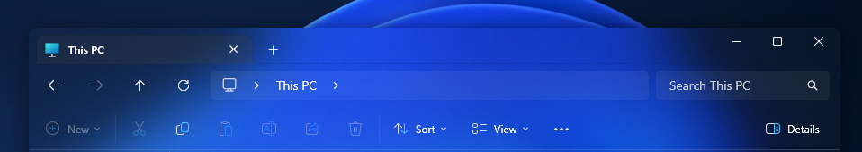

# Translucent Explorer 11 theme for Windows 11 File Explorer Styler

A theme that modifies the WinUI elements of Windows 11 File Explorer to a transparent/translucent background.

**Author**: [Undisputed00x](https://github.com/Undisputed00x)



**To get translucent effects, you can use the Translucent Windows mod.**

- Install the [Translucent Windows](https://windhawk.net/mods/translucent-windows) mod.
- Select an effect type option and save.

## Theme selection

The theme is integrated into the mod and can simply be selected from the mod's
settings:

* Open the Windows 11 File Explorer Styler mod in Windhawk.
* Go to the "Settings" tab.
* Select the theme and save the settings.

## Manual installation

The theme styles can also be imported manually. To do that, follow these steps:

* Open the Windows 11 File Explorer Styler mod in Windhawk.
* Go to the "Advanced" tab.
* Copy the content below to the text box under "Mod settings" and click "Save".

<details>
<summary>Content to import (click to expand)</summary>

```json
{
  "controlStyles[0].target": "Grid#CommandBarControlRootGrid",
  "controlStyles[0].styles[0]": "Background=Transparent",
  "controlStyles[0].styles[1]": "BorderThickness=0,0,0,1",
  "controlStyles[0].styles[2]": "BorderBrush=#40A0A0A0",
  "controlStyles[1].target": "CommandBar#FileExplorerCommandBar",
  "controlStyles[1].styles[0]": "Background=Transparent",
  "controlStyles[2].target": "Grid#NavigationBarControlGrid",
  "controlStyles[2].styles[0]": "Background=Transparent",
  "controlStyles[3].target": "TabViewItem > Grid#LayoutRoot > Canvas > Microsoft.UI.Xaml.Shapes.Path#SelectedBackgroundPath",
  "controlStyles[3].styles[0]": "Fill=#40404040",
  "controlStyles[4].target": "Grid#HomeViewRootGrid",
  "controlStyles[4].styles[0]": "Background=Transparent",
  "controlStyles[5].target": "FileExplorerExtensions.GalleryViewControl#GalleryViewControl > Grid",
  "controlStyles[5].styles[0]": "Background=Transparent",
  "controlStyles[6].target": "Microsoft.UI.Xaml.Controls.Grid#GalleryRootGrid",
  "controlStyles[6].styles[0]": "Background=Transparent",
  "controlStyles[7].target": "ToolTip",
  "controlStyles[7].styles[0]": "Background:=<AcrylicBrush TintColor=\"#121212\" Opacity=\"0.3\"/>",
  "controlStyles[8].target": "Grid#DetailsViewControlRootGrid",
  "controlStyles[8].styles[0]": "Background=Transparent",
  "controlStyles[9].target": "StackPanel#DetailsViewThumbnail > Grid",
  "controlStyles[9].styles[0]": "Background=Transparent",
  "explorerFrameContainerHeight": 0,
  "theme": ""
}
```
</details>
