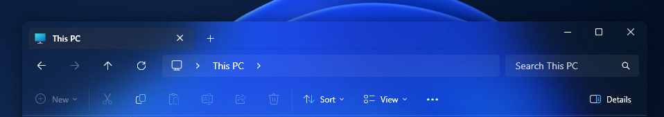

# Translucent Explorer 11 theme for Windows 11 File Explorer Styler

A theme that modifies the WinUI elements of Windows 11 File Explorer to a transparent/translucent background.

**Author**: [Undisputed00x](https://github.com/Undisputed00x)



**To get translucent effects, you can use the Translucent Windows mod.**

- Install the [Translucent Windows](https://windhawk.net/mods/translucent-windows) mod.
- Select an effect type option and save.

## Theme selection

The theme is integrated into the mod and can be selected directly from the mod's
settings:

* Open the Windows 11 File Explorer Styler mod in Windhawk.
* Go to the "Settings" tab.
* Select the theme and save the settings.

## Manual installation

The theme styles can also be imported manually. To do that, follow these steps:

* Open the Windows 11 File Explorer Styler mod in Windhawk.
* Go to the "Advanced" tab.
* Copy the content below to the text box under "Mod settings" and click "Save".

<details>
<summary>Content to import (click to expand)</summary>

```yaml
backgroundTranslucentEffect: acrylic
controlStyles:
  - target: Grid#CommandBarControlRootGrid
    styles:
      - Background=Transparent
      - BorderThickness=0,0,0,1
      - BorderBrush=#40A0A0A0
  - target: CommandBar#FileExplorerCommandBar
    styles:
      - Background=Transparent
  - target: Grid#NavigationBarControlGrid
    styles:
      - Background=Transparent
  - target: TabViewItem > Grid#LayoutRoot > Canvas > Microsoft.UI.Xaml.Shapes.Path#SelectedBackgroundPath
    styles:
      - Fill=#40404040
  - target: Grid#HomeViewRootGrid
    styles:
      - Background=Transparent
  - target: FileExplorerExtensions.GalleryViewControl#GalleryViewControl > Grid
    styles:
      - Background=Transparent
  - target: Microsoft.UI.Xaml.Controls.Grid#GalleryRootGrid
    styles:
      - Background=Transparent
  - target: ToolTip
    styles:
      - Background:=<AcrylicBrush TintColor="#121212" Opacity="0.3"/>
  - target: Grid#DetailsViewControlRootGrid
    styles:
      - Background=Transparent
  - target: StackPanel#DetailsViewThumbnail > Grid
    styles:
      - Background=Transparent
```
</details>
