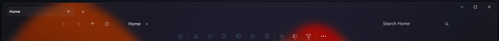
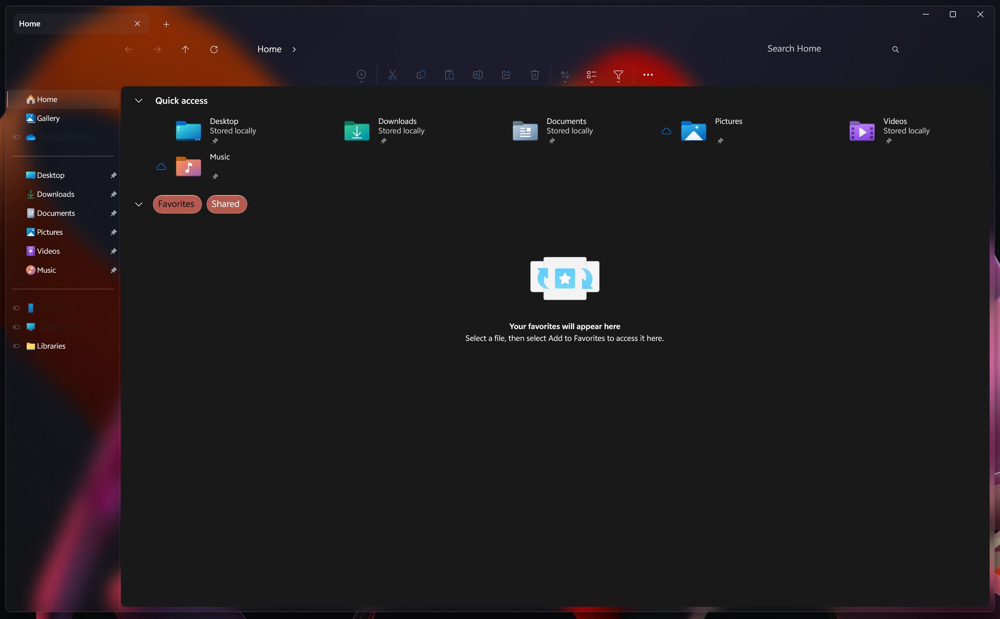

# WindowGlass theme for Windows 11 File Explorer Styler
A theme that gives a modern, glassy aesthetic to the Windows 11 File Explorer.

**Author**: [Nathaniel4JC](https://github.com/Nathaniel4JC)

## Preview



## Notes
- This theme works best on Windows 11 **22H2** and later.
- This theme currently works on displays with a resolution **above** 1366x768.
- The background material of Windows Explorer windows will depend on what material is selected. To choose between background materials, you can use the 'Translucent Windows' mod.
- This theme will only work on / can only style the WinUI parts of File Explorer.


## Full Window Preview with 'Blur(accent blur behind)' as the background material.
 
- Other background materials can be found in the 'Translucent Windows' mod, including:
  - Mica
  - Mica Alt
  - Acrylic


## More Details about this theme
- Theme is designed on Windows 11 - 24H2
- Not fully compatible with light mode yet...

## For a complete WindowGlass themed UI, download the following mods and use the 'WindowGlass' theme:
- Windows 11 TaskBar Styler – for styling the Taskbar.
- Windows 11 Notification Center Styler - for styling the Notification Center and Action Center
- Windows 11 Start Menu Styler - for styling Windows' Start Menu.

---

## Theme selection

The theme is integrated into the mod, and can be simply selected from the mod's
settings:

* Open the Windows 11 File Explorer Styler mod in Windhawk.
* Go to the "Settings" tab.
* Select the 'WindowGlass' theme and save the settings.

## Manual installation

The theme styles can also be imported manually. To do that, follow these steps:

* Open the Windows 11 File Explorer Styler mod in Windhawk.
* Go to the "Advanced" tab.
* Copy the content below to the text box under "Mod settings" and click "Save".

<details>
<summary>Content to import (click to expand)</summary>

```json

{
  "theme": "",
  "controlStyles[0].target": "Microsoft.UI.Xaml.Controls.Grid#PART_LayoutRoot",
  "controlStyles[0].styles[0]": "Background=Transparent",
  "controlStyles[0].styles[1]": "RenderTransform:=<TranslateTransform X=\"0\"/>",
  "controlStyles[1].target": "FileExplorerExtensions.FirstCrumbStackPanelControl#FirstCrumbStackPanel",
  "controlStyles[1].styles[0]": "Visibility=Collapsed",
  "controlStyles[2].target": "Windows.UI.Xaml.Controls.Grid#RootCommandSearchGrid > Windows.UI.Xaml.Controls.Border#BorderElement",
  "controlStyles[2].styles[0]": "Visibility=Collapsed",
  "controlStyles[3].target": "Microsoft.UI.Xaml.Controls.Primitives.NavigationViewItemPresenter#NavigationViewItemPresenter > Microsoft.UI.Xaml.Controls.Grid#LayoutRoot",
  "controlStyles[3].styles[0]": "BorderThickness=$BorderThickness",
  "controlStyles[3].styles[1]": "Background:=$ButtonBackground",
  "controlStyles[3].styles[2]": "BorderBrush:=$ButtonBorder",
  "controlStyles[4].target": "Microsoft.UI.Xaml.Controls.Grid#CommandBarControlRootGrid",
  "controlStyles[4].styles[0]": "Background:=Transparent",
  "controlStyles[4].styles[1]": "BorderBrush:=Transparent",
  "controlStyles[5].target": "Microsoft.UI.Xaml.Controls.CommandBar#FileExplorerCommandBar",
  "controlStyles[5].styles[0]": "RenderTransform:=<TranslateTransform X=\"0\" Y=\"0\" />",
  "controlStyles[5].styles[1]": "HorizontalAlignment=Center",
  "controlStyles[5].styles[2]": "Margin=-4",
  "controlStyles[5].styles[3]": "Padding=10",
  "controlStyles[6].target": "Microsoft.UI.Xaml.Controls.CommandBar#FileExplorerSecondaryCommandBar",
  "controlStyles[6].styles[0]": "RenderTransform:=<TranslateTransform X=\"Auto\" />",
  "controlStyles[6].styles[1]": "HorizontalAlignment=Center",
  "controlStyles[6].styles[2]": "Margin=-4",
  "controlStyles[6].styles[3]": "Padding=10",
  "controlStyles[6].styles[4]": "Visibility=Collapsed",
  "controlStyles[7].target": "Microsoft.UI.Xaml.Controls.CommandBar#FileExplorerCommandBar > Microsoft.UI.Xaml.Controls.Grid#LayoutRoot > Microsoft.UI.Xaml.Controls.Grid#ContentRoot",
  "controlStyles[7].styles[0]": "CornerRadius=$CornerRadius",
  "controlStyles[7].styles[1]": "BorderThickness=$BorderThickness",
  "controlStyles[7].styles[2]": "BorderBrush:=Transparent",
  "controlStyles[7].styles[3]": "Background:=Transparent",
  "controlStyles[8].target": "Microsoft.UI.Xaml.Controls.CommandBar#FileExplorerSecondaryCommandBar > Microsoft.UI.Xaml.Controls.Grid#LayoutRoot > Microsoft.UI.Xaml.Controls.Grid#ContentRoot",
  "controlStyles[8].styles[0]": "CornerRadius=$CornerRadius",
  "controlStyles[8].styles[1]": "BorderThickness=$BorderThickness",
  "controlStyles[8].styles[2]": "BorderBrush:=$BorderBrush",
  "controlStyles[8].styles[3]": "Background:=#10808080",
  "controlStyles[8].styles[4]": "Visibility=Collapsed",
  "controlStyles[9].target": "Microsoft.UI.Xaml.Controls.Grid#NavigationBarControlGrid",
  "controlStyles[9].styles[0]": "Background:=Transparent",
  "controlStyles[9].styles[1]": "BorderBrush:=Transparent",
  "controlStyles[10].target": "Microsoft.UI.Xaml.Controls.Grid#HomeViewRootGrid",
  "controlStyles[10].styles[0]": "BorderBrush:=$Background2",
  "controlStyles[10].styles[1]": "CornerRadius=8",
  "controlStyles[10].styles[2]": "BorderThickness=0",
  "controlStyles[10].styles[3]": "Margin=0,0,8,8",
  "controlStyles[11].target": "FileExplorerExtensions.GalleryViewControl#GalleryViewControl > Grid  ",
  "controlStyles[11].styles[0]": "BorderBrush:=$Background2",
  "controlStyles[11].styles[1]": "CornerRadius=8",
  "controlStyles[11].styles[2]": "BorderThickness=0",
  "controlStyles[11].styles[3]": "Margin=0,0,8,8",
  "controlStyles[12].target": "FileExplorerExtensions.GalleryViewControl#GalleryViewControl > Grid > Grid#GalleryRootGrid",
  "controlStyles[13].target": "ToolTip",
  "controlStyles[13].styles[0]": "Background:=$Background",
  "controlStyles[14].target": "Grid#TabContainerGrid > Border#LeftBottomBorderLine",
  "controlStyles[14].styles[0]": "Visibility=Collapsed",
  "controlStyles[15].target": "Grid#TabContainerGrid > Border#RightBottomBorderLine",
  "controlStyles[15].styles[0]": "Visibility=Collapsed",
  "controlStyles[16].target": "TabViewItem > Grid#LayoutRoot",
  "controlStyles[16].styles[0]": "CornerRadius=8",
  "controlStyles[16].styles[1]": "Margin=5",
  "controlStyles[16].styles[2]": "Height=35",
  "controlStyles[17].target": "TabViewItem > Grid#LayoutRoot > Canvas",
  "controlStyles[17].styles[0]": "Visibility=Collapsed",
  "controlStyles[18].target": "TabViewItem > Grid#LayoutRoot > Grid#TabContainer",
  "controlStyles[18].styles[0]": "Background=Transparent",
  "controlStyles[18].styles[1]": "BorderBrush=Transparent",
  "controlStyles[19].target": "TabViewItem > Grid#LayoutRoot@CommonStates",
  "controlStyles[19].styles[0]": "Background@Selected:=<SolidColorBrush Color=\"#808080\" Opacity=\"0.10\"/>",
  "controlStyles[19].styles[1]": "Background@PointerOverSelected:=<SolidColorBrush Color=\"#808080\" Opacity=\"0.10\"/>",
  "controlStyles[19].styles[2]": "Background@PointerOver:=<AcrylicBrush TintColor=\"Transparent\" Opacity=\"0.13\"/>",
  "controlStyles[19].styles[3]": "Background@Normal:=<AcrylicBrush TintColor=\"Transparent\" Opacity=\"0.05\"/>",
  "controlStyles[19].styles[4]": "Background@PressedSelected:=<SolidColorBrush Color=\"#808080\" Opacity=\"0.10\"/>",
  "controlStyles[20].target": "Grid#TabContainerGrid > Border#LeftBottomBorderLine",
  "controlStyles[20].styles[0]": "Visibility=Collapsed",
  "controlStyles[21].target": "Grid#TabContainerGrid > Border#RightBottomBorderLine",
  "controlStyles[21].styles[0]": "Visibility=Collapsed",
  "controlStyles[22].target": "Microsoft.UI.Xaml.Controls.Border#BottomBorderLine",
  "controlStyles[22].styles[0]": "Visibility=Collapsed",
  "controlStyles[23].target": "Microsoft.UI.Xaml.Shapes.Path#LeftRadiusRenderArc",
  "controlStyles[23].styles[0]": "Visibility=Collapsed",
  "controlStyles[24].target": "Microsoft.UI.Xaml.Shapes.Path#RightRadiusRenderArc",
  "controlStyles[24].styles[0]": "Visibility=Collapsed",
  "controlStyles[25].target": "Microsoft.UI.Xaml.Controls.Grid#TabContainer",
  "controlStyles[25].styles[0]": "Visibility=Visible",
  "controlStyles[26].target": "Microsoft.UI.Xaml.Controls.Viewbox#IconBox",
  "controlStyles[26].styles[0]": "Visibility=Collapsed",
  "controlStyles[27].target": "Microsoft.UI.Xaml.Controls.Primitives.CommandBarFlyoutCommandBar > Grid#LayoutRoot > Grid#OuterContentRoot > Grid#ContentRoot > Grid#PrimaryItemsRoot",
  "controlStyles[27].styles[0]": "Background:=$Background",
  "controlStyles[27].styles[1]": "BorderThickness=$BorderThickness",
  "controlStyles[27].styles[2]": "BorderBrush:=$BorderBrush",
  "controlStyles[27].styles[3]": "Margin=0,0,0,-5",
  "controlStyles[27].styles[4]": "CornerRadius=$CornerRadius",
  "controlStyles[28].target": "Grid#OuterOverflowContentRootV2 > Grid#OverflowContentRoot > CommandBarOverflowPresenter#SecondaryItemsControl > Grid#LayoutRoot",
  "controlStyles[28].styles[0]": "Background:=$Background",
  "controlStyles[28].styles[1]": "BorderThickness=$BorderThickness",
  "controlStyles[28].styles[2]": "BorderBrush:=$BorderBrush",
  "controlStyles[28].styles[3]": "CornerRadius=$CornerRadius",
  "controlStyles[29].target": "MenuFlyoutPresenter > Border",
  "controlStyles[29].styles[0]": "Background:=$Background",
  "controlStyles[29].styles[1]": "BorderThickness=$BorderThickness",
  "controlStyles[29].styles[2]": "BorderBrush:=$BorderBrush",
  "controlStyles[29].styles[3]": "CornerRadius=$CornerRadius",
  "controlStyles[30].target": "CommandBarOverflowPresenter#SecondaryItemsControl > Grid#LayoutRoot",
  "controlStyles[30].styles[0]": "Background:=$Background",
  "controlStyles[30].styles[1]": "BorderThickness=$BorderThickness",
  "controlStyles[30].styles[2]": "BorderBrush:=$BorderBrush",
  "controlStyles[30].styles[3]": "CornerRadius=$CornerRadius",
  "controlStyles[31].target": "Microsoft.UI.Xaml.Controls.AutoSuggestBox#FileExplorerSearchBox > Microsoft.UI.Xaml.Controls.Grid#LayoutRoot > Microsoft.UI.Xaml.Controls.TextBox#TextBox",
  "controlStyles[31].styles[0]": "CornerRadius=$CornerRadius",
  "controlStyles[31].styles[1]": "Width=250",
  "controlStyles[31].styles[2]": "RenderTransform:=<TranslateTransform X=\"-50\" />",
  "controlStyles[31].styles[3]": "Background:=Transparent",
  "controlStyles[31].styles[4]": "BorderBrush:=Transparent",
  "controlStyles[32].target": "Microsoft.UI.Xaml.Controls.Grid#FileExplorerAddressBarGrid",
  "controlStyles[32].styles[0]": "Width=800",
  "controlStyles[32].styles[1]": "HorizontalAlignment=Center",
  "controlStyles[32].styles[2]": "RenderTransform:=<TranslateTransform X=\"100\" />",
  "controlStyles[32].styles[3]": "CornerRadius=$CornerRadius",
  "controlStyles[33].target": "Microsoft.UI.Xaml.Controls.AutoSuggestBox#PART_AutoSuggestBox > Microsoft.UI.Xaml.Controls.Grid#LayoutRoot > Microsoft.UI.Xaml.Controls.TextBox#TextBox",
  "controlStyles[33].styles[0]": "CornerRadius=$CornerRadius",
  "controlStyles[34].target": "Microsoft.UI.Xaml.Controls.CommandBar#NavigationCommands",
  "controlStyles[34].styles[0]": "RenderTransform:=<TranslateTransform X=\"180\" />",
  "controlStyles[35].target": "Microsoft.UI.Xaml.Controls.Grid#RootContainer",
  "controlStyles[35].styles[0]": "Background:=Transparent",
  "controlStyles[36].target": "Microsoft.UI.Xaml.Controls.Border > Microsoft.UI.Xaml.Controls.Button#AddButton",
  "controlStyles[36].styles[0]": "RenderTransform:=<TranslateTransform Y=\"-6\" />",
  "controlStyles[37].target": "Microsoft.UI.Xaml.Controls.TextBlock#TextLabel",
  "controlStyles[37].styles[0]": "Visibility=Collapsed",
  "controlStyles[38].target": "Microsoft.UI.Xaml.Controls.Grid#SubItemChevronPanel > Microsoft.UI.Xaml.Controls.FontIcon#SubItemChevron",
  "controlStyles[38].styles[0]": "RenderTransform:=<TranslateTransform X=\"-5\" Y=\"12\" />",
  "resourceVariables[0].variableKey": "",
  "resourceVariables[0].value": "",
  "explorerFrameContainerHeight": 0,
  "styleConstants[0]": "Background=<WindhawkBlur BlurAmount=\"15\" TintColor=\"#15323232\"/>",
  "styleConstants[1]": "BorderBrush=<LinearGradientBrush StartPoint=\"0,0\" EndPoint=\"0,1\"><GradientStop Color=\"{ThemeResource SystemChromeHighColor}\" Offset=\"0.0\" /><GradientStop Color=\"{ThemeResource SystemChromeLowColor}\" Offset=\"0.15\" /><GradientStop Color=\"{ThemeResource SystemChromeHighColor}\" Offset=\"0.95\" /></LinearGradientBrush>",
  "styleConstants[2]": "BorderThickness=0.3,1,0.3,0.3",
  "styleConstants[3]": "ButtonBackground=<SolidColorBrush Color=\"{ThemeResource SystemAccentColor}\" Opacity=\"1\" />",
  "styleConstants[4]": "ButtonBorder=<SolidColorBrush Color=\"{ThemeResource SystemAccentColorLight3}\" Opacity=\"1\" />",
  "styleConstants[5]": "CornerRadius=8",
  "styleConstants[6]": "Background2=<SolidColorBrush Color=\"{ThemeResource SystemChromeAltHighColor}\" Opacity=\"0\" />"
}
```
</details>
