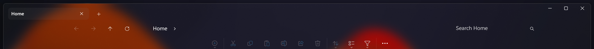
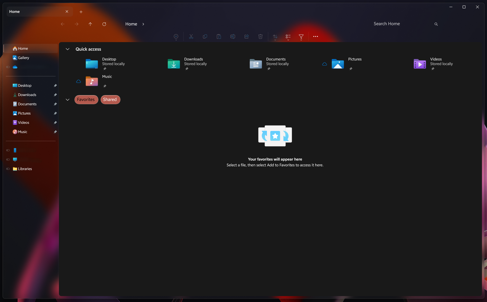

# WindowGlass theme for Windows 11 File Explorer Styler
A theme that gives Windows 11 File Explorer a modern, glassy aesthetic with a compact layout.

**Author**: [Nathaniel4JC](https://github.com/Nathaniel4JC)

## Preview


## Notes
- This theme works best on Windows 11 **22H2** and later.
- This theme currently works on displays with a resolution **above** 1366x768.
- The background material of Windows Explorer windows will depend on what material is selected. To choose between background materials, you can use the 'Translucent Windows' mod.
- This theme will only work on / can only style the WinUI parts of File Explorer.

## Full window preview with 'Blur (accent blur behind)' as the background material.
 
- Other background materials can be found in the 'Translucent Windows' mod, including:
  - Mica
  - Mica Alt
  - Acrylic

## More details about this theme
- Designed for Windows 11 24H2.
- Not fully compatible with light mode yet.

## For a complete WindowGlass-themed UI, download the following mods and use the 'WindowGlass' theme:
- Windows 11 Taskbar Styler - for styling the taskbar.
- Windows 11 Notification Center Styler - for styling the Notification Center and Action Center.
- Windows 11 Start Menu Styler - for styling the Windows Start menu.

---

## Theme selection

The theme is integrated into the mod and can be selected directly from the mod's
settings:

* Open the Windows 11 File Explorer Styler mod in Windhawk.
* Go to the "Settings" tab.
* Select the theme and save the settings.

## Manual installation

The theme styles can also be imported manually. To do that, follow these steps:

* Open the Windows 11 File Explorer Styler mod in Windhawk.
* Go to the "Settings" tab and select "Textual mode".
* Copy the content below to the text box and click "Save settings".

<details>
<summary>Content to import (click to expand)</summary>

```yaml
backgroundTranslucentEffect: acrylic
styleConstants:
  - Background=<WindhawkBlur BlurAmount="15" TintColor="#15323232"/>
  - BorderBrush=<LinearGradientBrush StartPoint="0,0" EndPoint="0,1"><GradientStop Color="{ThemeResource SystemChromeHighColor}" Offset="0.0" /><GradientStop Color="{ThemeResource SystemChromeLowColor}" Offset="0.15" /><GradientStop Color="{ThemeResource SystemChromeHighColor}" Offset="0.95" /></LinearGradientBrush>
  - BorderThickness=0.3,1,0.3,0.3
  - ButtonBackground=<SolidColorBrush Color="{ThemeResource SystemAccentColor}" Opacity="1" />
  - ButtonBorder=<SolidColorBrush Color="{ThemeResource SystemAccentColorLight3}" Opacity="1" />
  - CornerRadius=8
  - Background2=<SolidColorBrush Color="{ThemeResource SystemChromeAltHighColor}" Opacity="0" />
  - MainContentBG=<SolidColorBrush Color="{ThemeResource SystemChromeAltHighColor}" Opacity="1" />
controlStyles:
  - target: Microsoft.UI.Xaml.Controls.Grid#PART_LayoutRoot
    styles:
      - Background=Transparent
      - RenderTransform:=<TranslateTransform X="0"/>
  - target: FileExplorerExtensions.FirstCrumbStackPanelControl#FirstCrumbStackPanel
    styles:
      - Visibility=Collapsed
  - target: Windows.UI.Xaml.Controls.Grid#RootCommandSearchGrid > Windows.UI.Xaml.Controls.Border#BorderElement
    styles:
      - Visibility=Collapsed
  - target: Microsoft.UI.Xaml.Controls.Primitives.NavigationViewItemPresenter#NavigationViewItemPresenter > Microsoft.UI.Xaml.Controls.Grid#LayoutRoot
    styles:
      - BorderThickness=$BorderThickness
      - Background:=$ButtonBackground
      - BorderBrush:=$ButtonBorder
  - target: Microsoft.UI.Xaml.Controls.Grid#CommandBarControlRootGrid
    styles:
      - Background=Transparent
      - BorderBrush=Transparent
  - target: Microsoft.UI.Xaml.Controls.CommandBar#FileExplorerCommandBar
    styles:
      - RenderTransform:=<TranslateTransform X="0" Y="0" />
      - HorizontalAlignment=Center
      - Margin=-4
      - Padding=10
  - target: Microsoft.UI.Xaml.Controls.CommandBar#FileExplorerSecondaryCommandBar
    styles:
      - RenderTransform:=<TranslateTransform X="Auto" />
      - HorizontalAlignment=Center
      - Margin=-4
      - Padding=10
      - Visibility=Collapsed
  - target: Microsoft.UI.Xaml.Controls.CommandBar#FileExplorerCommandBar > Microsoft.UI.Xaml.Controls.Grid#LayoutRoot > Microsoft.UI.Xaml.Controls.Grid#ContentRoot
    styles:
      - CornerRadius=$CornerRadius
      - BorderThickness=$BorderThickness
      - BorderBrush=Transparent
      - Background=Transparent
  - target: Microsoft.UI.Xaml.Controls.CommandBar#FileExplorerSecondaryCommandBar > Microsoft.UI.Xaml.Controls.Grid#LayoutRoot > Microsoft.UI.Xaml.Controls.Grid#ContentRoot
    styles:
      - CornerRadius=$CornerRadius
      - BorderThickness=$BorderThickness
      - BorderBrush:=$BorderBrush
      - Background=#10808080
      - Visibility=Collapsed
  - target: Microsoft.UI.Xaml.Controls.Grid#NavigationBarControlGrid
    styles:
      - Background=Transparent
      - BorderBrush=Transparent
      - ColumnDefinitions:=<ColumnDefinitionCollection><ColumnDefinition Width="Auto"/><ColumnDefinition Width="*"/><ColumnDefinition Width="430"/></ColumnDefinitionCollection>
  - target: Microsoft.UI.Xaml.Controls.Grid#HomeViewRootGrid
    styles:
      - BorderBrush:=$MainContentBG
      - CornerRadius=8
      - BorderThickness=0
      - Margin=0,0,8,8
      - Background:=$MainContentBG
  - target: FileExplorerExtensions.GalleryViewControl#GalleryViewControl > Grid
    styles:
      - BorderBrush:=$MainContentBG
      - CornerRadius=8
      - BorderThickness=0
      - Margin=0,0,8,8
      - Background:=$MainContentBG
  - target: FileExplorerExtensions.GalleryViewControl#GalleryViewControl > Grid > Grid#GalleryRootGrid
    styles:
      - Background:=$MainContentBG
  - target: ToolTip
    styles:
      - Background:=$Background
  - target: Grid#TabContainerGrid > Border#LeftBottomBorderLine
    styles:
      - Visibility=Collapsed
  - target: Grid#TabContainerGrid > Border#RightBottomBorderLine
    styles:
      - Visibility=Collapsed
  - target: TabViewItem > Grid#LayoutRoot
    styles:
      - CornerRadius=8
      - Margin=5
      - Height=35
  - target: TabViewItem > Grid#LayoutRoot > Canvas
    styles:
      - Visibility=Collapsed
  - target: TabViewItem > Grid#LayoutRoot > Grid#TabContainer
    styles:
      - Background=Transparent
      - BorderBrush=Transparent
  - target: TabViewItem > Grid#LayoutRoot@CommonStates
    styles:
      - Background@Selected:=<SolidColorBrush Color="#808080" Opacity="0.10"/>
      - Background@PointerOverSelected:=<SolidColorBrush Color="#808080" Opacity="0.10"/>
      - Background@PointerOver:=<AcrylicBrush TintColor="Transparent" Opacity="0.13"/>
      - Background@Normal:=<AcrylicBrush TintColor="Transparent" Opacity="0.05"/>
      - Background@PressedSelected:=<SolidColorBrush Color="#808080" Opacity="0.10"/>
  - target: Grid#TabContainerGrid > Border#LeftBottomBorderLine
    styles:
      - Visibility=Collapsed
  - target: Grid#TabContainerGrid > Border#RightBottomBorderLine
    styles:
      - Visibility=Collapsed
  - target: Microsoft.UI.Xaml.Controls.Border#BottomBorderLine
    styles:
      - Visibility=Collapsed
  - target: Microsoft.UI.Xaml.Shapes.Path#LeftRadiusRenderArc
    styles:
      - Visibility=Collapsed
  - target: Microsoft.UI.Xaml.Shapes.Path#RightRadiusRenderArc
    styles:
      - Visibility=Collapsed
  - target: Microsoft.UI.Xaml.Controls.Grid#TabContainer
    styles:
      - Visibility=Visible
  - target: Microsoft.UI.Xaml.Controls.Viewbox#IconBox
    styles:
      - Visibility=Collapsed
  - target: Microsoft.UI.Xaml.Controls.Primitives.CommandBarFlyoutCommandBar > Grid#LayoutRoot > Grid#OuterContentRoot > Grid#ContentRoot > Grid#PrimaryItemsRoot
    styles:
      - Background:=$Background
      - BorderThickness=$BorderThickness
      - BorderBrush:=$BorderBrush
      - Margin=0,0,0,-5
      - CornerRadius=$CornerRadius
  - target: Grid#OuterOverflowContentRootV2 > Grid#OverflowContentRoot > CommandBarOverflowPresenter#SecondaryItemsControl > Grid#LayoutRoot
    styles:
      - Background:=$Background
      - BorderThickness=$BorderThickness
      - BorderBrush:=$BorderBrush
      - CornerRadius=$CornerRadius
  - target: MenuFlyoutPresenter > Border
    styles:
      - Background:=$Background
      - BorderThickness=$BorderThickness
      - BorderBrush:=$BorderBrush
      - CornerRadius=$CornerRadius
  - target: CommandBarOverflowPresenter#SecondaryItemsControl > Grid#LayoutRoot
    styles:
      - Background:=$Background
      - BorderThickness=$BorderThickness
      - BorderBrush:=$BorderBrush
      - CornerRadius=$CornerRadius
  - target: Microsoft.UI.Xaml.Controls.AutoSuggestBox#FileExplorerSearchBox > Microsoft.UI.Xaml.Controls.Grid#LayoutRoot > Microsoft.UI.Xaml.Controls.TextBox#TextBox
    styles:
      - CornerRadius=$CornerRadius
      - Margin=0,0,180,0
      - Background=Transparent
      - BorderBrush=Transparent
  - target: Microsoft.UI.Xaml.Controls.Grid#FileExplorerAddressBarGrid
    styles:
      - MaxWidth=750
      - CornerRadius=$CornerRadius
  - target: Microsoft.UI.Xaml.Controls.AutoSuggestBox#PART_AutoSuggestBox > Microsoft.UI.Xaml.Controls.Grid#LayoutRoot > Microsoft.UI.Xaml.Controls.TextBox#TextBox
    styles:
      - CornerRadius=$CornerRadius
  - target: Microsoft.UI.Xaml.Controls.CommandBar#NavigationCommands
    styles:
      - Margin=180,0,0,0
  - target: Microsoft.UI.Xaml.Controls.Grid#RootContainer
    styles:
      - Background=Transparent
  - target: Microsoft.UI.Xaml.Controls.Border > Microsoft.UI.Xaml.Controls.Button#AddButton
    styles:
      - RenderTransform:=<TranslateTransform Y="-6" />
  - target: Microsoft.UI.Xaml.Controls.TextBlock#TextLabel
    styles:
      - Visibility=Collapsed
  - target: Microsoft.UI.Xaml.Controls.Grid#SubItemChevronPanel > Microsoft.UI.Xaml.Controls.FontIcon#SubItemChevron
    styles:
      - RenderTransform:=<TranslateTransform X="-5" Y="12" />
```
</details>
